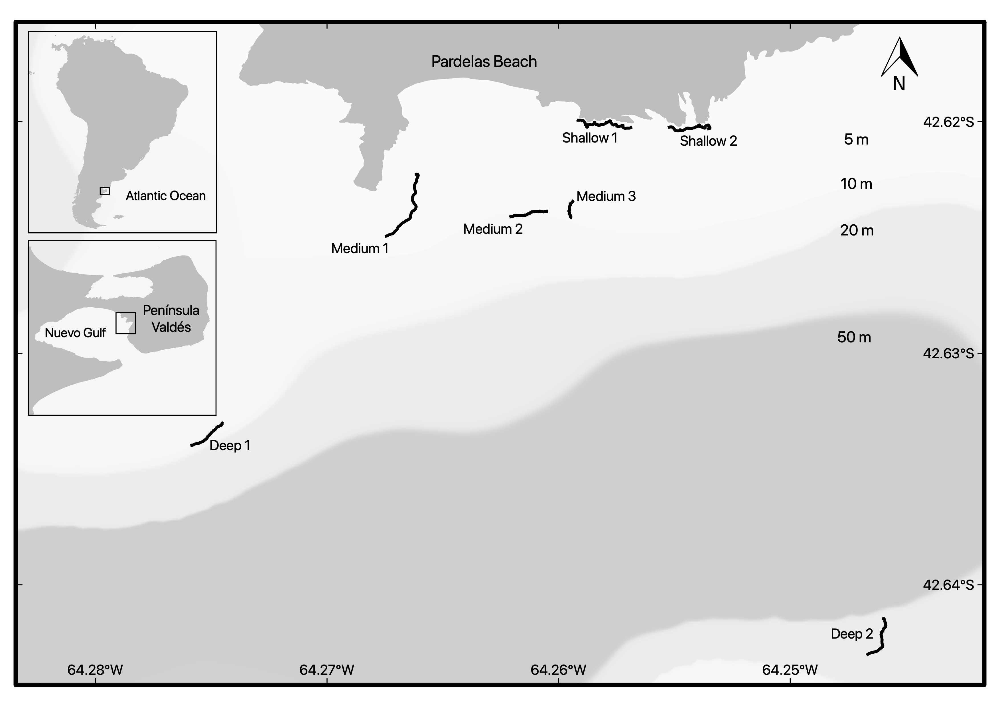

```{r setup, include=FALSE}
knitr::opts_chunk$set(echo = TRUE)
Density.data <- read.csv("Density_Data.csv")
#take out row (photos) with cero organisms on it 
#Density.data <- Density.data[which(rowSums(Density.data[,-(1:20)]) > 0),]
#calculate abundance.m-2
Density.data[,-(1:20)] <- Density.data[,-(1:20)]/0.0625

library(doBy)
densitybyPseudechinus.magellanicus <- summaryBy(Pseudechinus.magellanicus  ~ reef.area + Depth,   data =Density.data, FUN = function(x) { c(mean = mean(x), SD=sd(x),SE = sqrt(var(x)/length(x)),max=max(x),n=length(x)) })
colnames(densitybyPseudechinus.magellanicus) <- c("Reef Area","Depth","Mean","SD","SE","Max","n")

densitydiablito <- summaryBy(Helcogrammoides.cunninghami~ reef.area + Depth,   data =Density.data, FUN = function(x) { c(mean = mean(x), SD=sd(x),SE = sqrt(var(x)/length(x)),max=max(x),n=length(x)) })
colnames(densitydiablito) <- c("Reef Area","Depth","Mean","SD","SE","Max","n")

densitydiablitobyreef <- summaryBy(Helcogrammoides.cunninghami~ reef.name,   data =Density.data, FUN = function(x) { c(mean = mean(x), SD=sd(x),SE = sqrt(var(x)/length(x)),max=max(x),n=length(x)) })
colnames(densitydiablitobyreef) <- c("Reef name","Mean","SD","SE","Max","n")

```

## Unpublished data from: "The importance of surface orientation in biodiversity monitoring protocols: the case of Patagonian rocky reefs"

Rocky reefs were sampled at three different depth ranges 1-7 m (n= 2 reefs), 8-15 m (n= 3 reefs) and 16-25 m (n= 2 reefs) during the same week.Ledge borders were followed as underwater transects in all reefs. The presence of caves of 1.5 to 3 m high below the rocky ledges provided enough space to sample 4 different surface orientations (namely horizontal, vertical, overhangs and cavefloor). Photoquadrats (25 x 25 cm) spaced at 2-5 m intervals were taken by scuba diving.

```{r pressure, echo=FALSE, fig.cap="Study site", out.width = '100%'}

```

## Density *Helcogrammoides cunninghami* by **Reef surface orientations** and **Depth**
```{r, warning = F, echo=FALSE}
library(knitr)
library(kableExtra)
options(knitr.kable.NA = '')
knitr::kable(densitydiablito,align="l",digits = 3,format = "pandoc",row.names=FALSE,booktabs = T, caption = "Density (ind.m-2) Helcogrammoides cunninghami")
```

## Density *Helcogrammoides cunninghami* by **Reef** 

```{r, warning = F, echo=FALSE}
library(knitr)
library(kableExtra)
options(knitr.kable.NA = '')
knitr::kable(densitydiablitobyreef,align="l",digits = 3,format = "pandoc",row.names=FALSE,booktabs = T, caption = "Density (ind.m-2) Helcogrammoides cunninghami")
```


