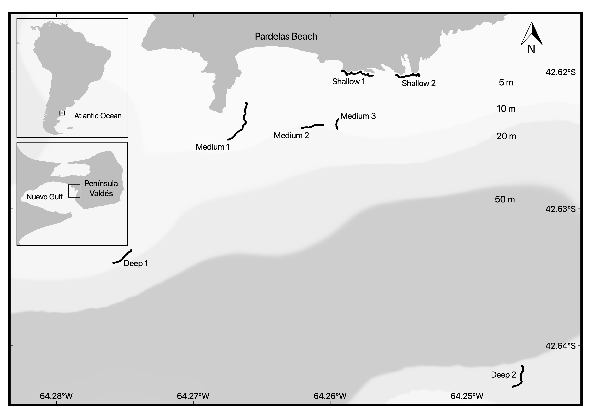

```{r setup, include=FALSE}
knitr::opts_chunk$set(echo = TRUE)
Density.data <- read.csv("Density_Data.csv")
#take out row (photos) with cero organisms on it 
#Density.data <- Density.data[which(rowSums(Density.data[,-(1:20)]) > 0),]
#calculate abundance.m-2
Density.data[,-(1:20)] <- Density.data[,-(1:20)]/0.0625

library(doBy)
densitybyPseudechinus.magellanicus <- summaryBy(Pseudechinus.magellanicus  ~ reef.area + Depth,   data =Density.data, FUN = function(x) { c(mean = mean(x), SD=sd(x),SE = sqrt(var(x)/length(x)),max=max(x),n=length(x)) })
colnames(densitybyPseudechinus.magellanicus) <- c("Reef Area","Depth","Mean","SD","SE","Max","n")

densitydiablito <- summaryBy(Helcogrammoides.cunninghami~ reef.area + Depth,   data =Density.data, FUN = function(x) { c(mean = mean(x), SD=sd(x),SE = sqrt(var(x)/length(x)),max=max(x),n=length(x)) })
colnames(densitydiablito) <- c("Reef Area","Depth","Mean","SD","SE","Max","n")


#calculate density only for Horizontal surfaces
Density.data.horizontal <- subset(Density.data, reef.area=="horizontal")
Pseudechinus.horizontal <- summaryBy(Pseudechinus.magellanicus  ~  Depth,   data =Density.data.horizontal, FUN = function(x) { c(mean = mean(x), SD=sd(x),SE = sqrt(var(x)/length(x)),n=length(x),max= max(x)) })
colnames(Pseudechinus.horizontal) <- c("Depth","Pseudechinus magellanicus","SD","SE","n","max density")

Arbacia.horizontal <- summaryBy(Arbacia.dufresnii  ~  Depth,   data =Density.data.horizontal, FUN = function(x) { c(mean = mean(x), SD=sd(x),SE = sqrt(var(x)/length(x)),n=length(x),max= max(x)) })
colnames(Arbacia.horizontal) <- c("Depth","Arbacia dufresnii","SD","SE","n","max density")

position <- c("deep","medium","shallow")
l <- list(Pseudechinus.horizontal,Arbacia.horizontal)
library(ggplot2)
listplotsdensity<- lapply(l, function (j) ggplot(j, aes(y=j[,2], x=Depth)) + geom_bar(stat="identity", color="black",position=position_dodge(),na.rm = TRUE) +geom_errorbar(aes(ymin=j[,2], ymax=j[,2]+j[,4]), width=.2,position=position_dodge(.9),na.rm = TRUE)+coord_flip()+ scale_fill_grey(start = 0.2, end = .9)+theme_bw()+ theme(plot.title = element_text(size = 10, face = "italic"))+labs(y= expression(paste("Density (ind. m"^"-2"," ± SE)")),x=element_blank())+ ggtitle(names(j[2]))+scale_x_discrete(limits = position,labels=c("Deep(16-25 m)","Medium(8-15 m)","Shallow (1-7 m )")))

```

## Unpublished data from: "The importance of surface orientation in biodiversity monitoring protocols: the case of Patagonian rocky reefs"

Rocky reefs were sampled at three different depth ranges 1-7 m (n= 2 reefs), 8-15 m (n= 3 reefs) and 16-25 m (n= 2 reefs) during the same week.Ledge borders were followed as underwater transects in all reefs. The presence of caves of 1.5 to 3 m high below the rocky ledges provided enough space to sample 4 different surface orientations (namely horizontal, vertical, overhangs and cavefloor). Photoquadrats (25 x 25 cm) spaced at 2-5 m intervals were taken by scuba diving.

```{r pressure, echo=FALSE, fig.cap="Study site", out.width = '100%'}

```


## Density *Pseudechinus magellanicus* by **Reef surface orientations** and **Depth**

```{r, warning = F, echo=FALSE}
library(knitr)
library(kableExtra)
options(knitr.kable.NA = '')
knitr::kable(densitybyPseudechinus.magellanicus,align="l",digits = 3,format = "pandoc",row.names=FALSE,booktabs = T, caption = "Density (ind.m-2) Pseudechinus.magellanicus ")
```

## Only for **Horizontal surfaces orientations**

```{r, warning = F, echo=FALSE}
library(knitr)
library(kableExtra)
options(knitr.kable.NA = '')
knitr::kable(Pseudechinus.horizontal,align="l",digits = 3,format = "pandoc",row.names=FALSE,booktabs = T, caption = "Density (ind.m-2) Pseudechinus.magellanicus")
```

```{r, warning = F, echo=FALSE}
library(knitr)
library(kableExtra)
options(knitr.kable.NA = '')
knitr::kable(Arbacia.horizontal,align="l",digits = 3,format = "pandoc",row.names=FALSE,booktabs = T, caption = "Density (ind.m-2) Arbacia dufresnii ")
```

## Plots for **Horizontal surface orientations**

```{r echo=FALSE, fig.cap='Density *Pseudechinus magellanicus* by depth', fig.height=2.5, fig.width=6, message=FALSE, warning=FALSE}
listplotsdensity[[1]]
```

```{r echo=FALSE, fig.cap='Density *Arbacia dufresnii* by depth', fig.height=2.5, fig.width=6, warning=FALSE}
listplotsdensity[[2]]
```


## Density *Helcogrammoides cunninghami* by **Reef surface orientations** and **Depth**
```{r, warning = F, echo=FALSE}
library(knitr)
library(kableExtra)
options(knitr.kable.NA = '')
knitr::kable(densitydiablito,align="l",digits = 3,format = "pandoc",row.names=FALSE,booktabs = T, caption = "Density (ind.m-2) Helcogrammoides cunninghami")
```
